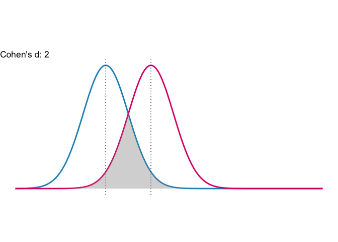
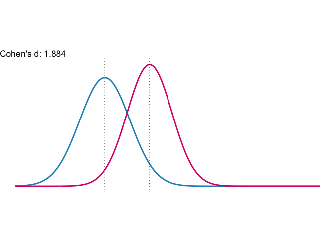

<!-- README.md is generated from README.Rmd. Please edit that file -->

# powerPsych 

<!-- badges: start -->

 [](https://www.tidyverse.org/lifecycle/#experimental)
[](https://cran.r-project.org/web/licenses/MIT)

<!-- badges: end -->

The goal of `powerPsych` is to provide behavioral scientists a package
to calculate and understand effect size and power. `powerPsych` is a
collection of statistical analysis tools, visualization, and calculator
that are useful for behavioral researchers. This package is separated by
three main analysis:

1.  Effect size
2.  Statistical power
3.  Sample size

This package was built for my STAT 545B course at the University of
British Columbia. I built this package based
[this](https://www.ai-therapy.com/psychology-statistics/) website’s
calculations. Admittedly, their website is much easier to use but here I
offer an alternative for people that prefer typesetting.

## Installation

`powerPsych` is not on CRAN, you need to install it via [GitHub]():

``` r
devtools::install_github("andr3wli/powerPsych")
```

## Effect size

Effect size is a standardized way to report the strength of an apparent
relationship. This part of the package dives into *Cohen’s d*. Cohen’s d
is very popular in psychology. `cohen.d` is a function that exists
already that computes the Cohen’s d and Hedge’s effect size statistic. I
offer two new functions to help calculate and interpret this statistic.
Cohen’s d can be categorized as follows:

| cohen’s d | Interpretation  |
|-----------|-----------------|
| 0.2       | A small effect  |
| 0.5       | A medium effect |
| 0.8+      | A large effect  |

-   `cohens_d` is a calculator that compares two populations/groups
    effect size via the two means. `cohens_d` consumes the mean and
    standard deviation of of two groups and it calculates the statistic
    and informs the user of the effect size.

-   `cohens_plot` is a visualization tool to help aid the interpretation
    of Cohen’s d value.

### Here are some examples of `cohens_d`:

``` r
library(powerPsych)

cohens_d(mean.one = 0, mean.two = 0.35, sd.one = 0.5, sd.two = 0.6, sd = "diff")
#> Cohen's d is 0.634 which is considered to be medium effect size.
cohens_d(0, -0.35, 0.5, sd = "same")
#> Cohen's d is 0.7 which is considered to be a relatively small effect size.
```

### Here are some examples of `cohens_plot`:

``` r
cohens_plot(mean.one = 0, mean.two = 1, sd.one = 0.5, sd.two = 0.5)
```



``` r
cohens_plot(0, 1, 0.56, 0.5, overlap = F)
```



**Note:** Effect sizes are computed using the methods outlined in the
paper “Olejnik, S. & Algina, J. 2003. Generalized Eta and Omega Squared
Statistics: Measures of Effect Size for Some Common Research Designs
*Psychological Methods. 8:(4)434-447*”.

## Workflow

Here I will describe the workflow for building this package.

-   I loaded the `devtools` package and created a new package called
    powerPsych

    -   `devtools::create_package("powerPsych)`

-   Initialized the package repo

    -   `use_git()`

-   Created my R script for `cohens_d`

    -   `use_r("cohens_d")`

-   Used Roxygen2 to create the documents and to export them

-   Created my tests for the function

    -   `use_testthat()`
    -   `use_test(cohens_d)`

-   Created a README and rendered the R markdown file to a regular
    markdown file

    -   `use_readme_rmd`
    -   `build_readme()`

-   Created my vignettes and built it

    -   `use_vignette("cohens_d")`
    -   `build_vignette()`

-   Created the R package website

    -   `use_pkgdown()`
    -   `build_site()`

## Statistical power

I will build upon this package for the final assignment for STAT 545B. I
plan on having a t-test calculator and a F-test calculator.

## Sample size

I will build upon this package for the final assignment for STAT 545B. I
plan on creating a function that can inform researchers the sample size
needed so that the experiment has sufficient statistical power.

## Acknowledgement

The STAT 545B teaching team deserves a huge amount of credit for
teaching this course so wonderfully! Thank you to our prof [Vincenzo
Coia](https://vincenzocoia.com) and our wonderful TAs [Almas Khan](),
[Diana Lin](http://www.birollab.ca/member/dlin), [Icíar Fernández
Boyano](), and [Victor Yuan]().

## Code of Conduct

Please note that the powerPsych project is released with a [Contributor
Code of
Conduct](https://contributor-covenant.org/version/2/0/CODE_OF_CONDUCT.html).
By contributing to this project, you agree to abide by its terms.

<!-- ## Citations -->
<!-- Run this command to get information about how to cite this package: -->
<!-- ```{r} -->
<!-- citation("powerPsych") -->
<!-- ``` -->
